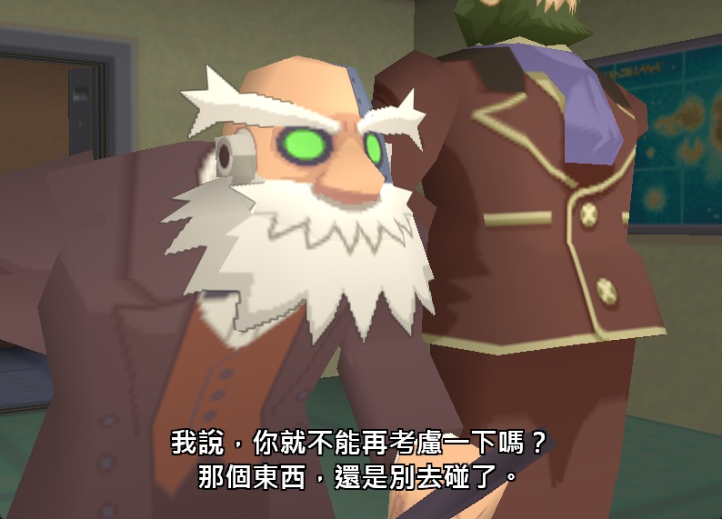
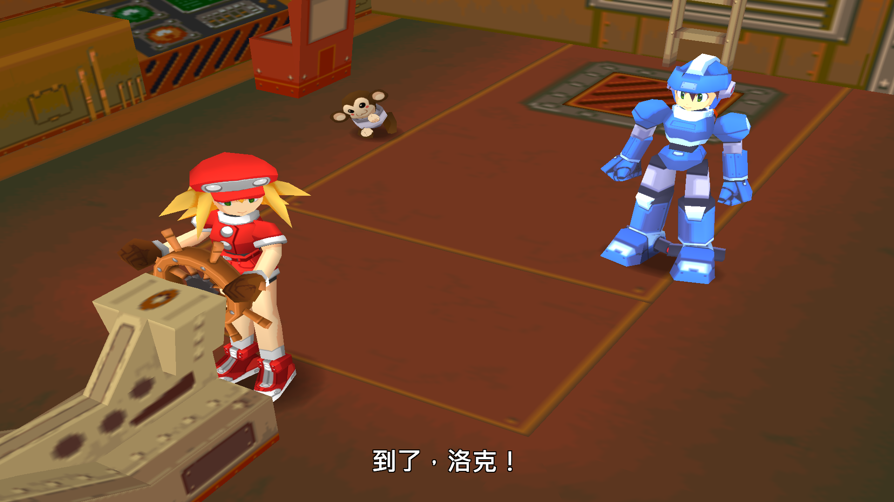
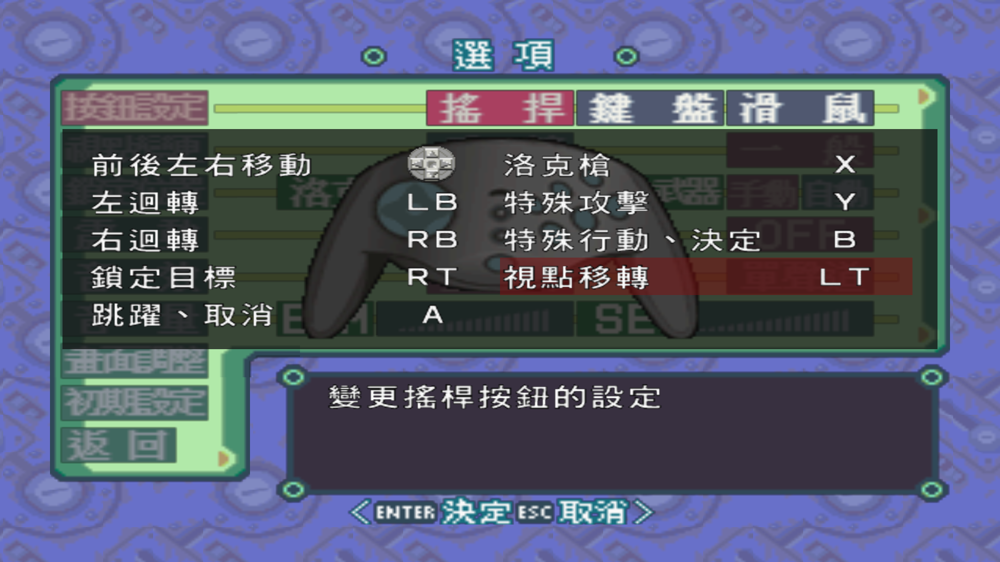
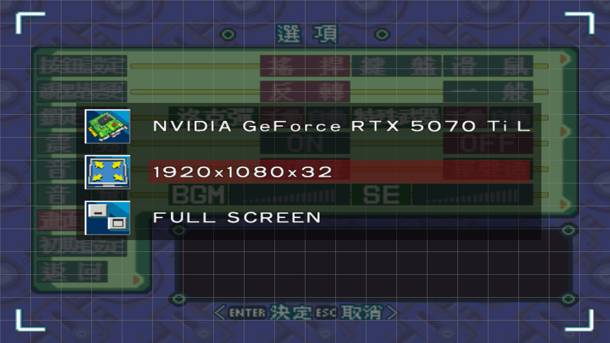

# 洛克人 DASH 2 增強補丁

針對特定繁體中文版 PC 遊戲製作的非官方 Windows 補丁。玩家只需使用一個 `RockmanDash2-Enhanced.exe`，即可同時啟用繁體中文字幕、XInput 手把及高解析度三項功能；ISO 格式轉換可將映像檔拖到 [Convert-DiscImage.cmd](Convert-DiscImage.cmd)，由同資料夾的 [Convert-DiscImage.ps1](Convert-DiscImage.ps1) 處理。**補丁不含原版遊戲或光碟映像檔，請自行準備。**

目前正式版本為 **v1.0.1**，新增可直接拖入 ISO 的轉換入口。下載請前往 [GitHub 最新正式版](https://github.com/vick0907/rockman-dash2-enhanced/releases/latest)，無須登入即可下載。初次使用建議下載檔名以 `-windows.zip` 結尾的玩家完整包，其中只有一個供玩家啟動的 EXE，並附拖放入口、轉換腳本、中文說明及授權文件。也可單獨下載 EXE；需要轉換 ISO 時，再下載下面的兩個轉換檔案。

使用拖放轉換時，請將 [Convert-DiscImage.cmd](Convert-DiscImage.cmd) 與 [Convert-DiscImage.ps1](Convert-DiscImage.ps1) 放在同一資料夾；v1.0.1 玩家版 ZIP 已一併收錄。既有 v1.0.0 使用者也可只下載這兩個檔案，不必為了 ISO 轉換替換遊戲啟動器。

### v1.0.1 更新

- 將一個 ISO 或 BIN 拖到 [Convert-DiscImage.cmd](Convert-DiscImage.cmd) 即可轉換，不必輸入 PowerShell 指令；完成或失敗都會保留結果視窗。
- 轉換結果放在來源旁的 `*.windows.iso`，保留來源，並沿用既有的標準 ISO 辨識及覆寫保護。轉換程式本身未改動。
- 更新玩家 ZIP、獨立下載附件、雜湊清單及操作說明。字幕、手把、高解析度功能與字幕資料沿用 v1.0.0；本次只更新轉換入口及封裝版本。

## 四項改動

- **繁體中文字幕**：在已辨識的過場、特定戰鬥通訊、額外事件與片尾曲中，依遊戲音訊播放進度顯示字幕，不覆蓋一般原生對話框。目前收錄 1,206 則字幕：開場 20 則、劇情 1,137 則、戰鬥通訊 32 則、特定事件 1 則、片尾曲 16 則。包含過場銜接、戰鬥語音顯示條件與終盤漏句修正；這不代表已涵蓋全部對白，或每一句的時間軸都經過完整人工校對。
- **XInput 手把支援**：原生控制器設定頁顯示 Xbox 按鍵名稱，右搖桿透過原生滑鼠輸入控制視角，左搖桿與方向鍵負責移動。目前設定使用玩家 1／插槽 0，保留遊戲既有的按鍵配置。
- **高解析度支援**：修正遊戲顯示記憶體計算，在原生選單選擇最高 `1920x1080` 的可用模式，並保留版本特徵檢查。這是提高實際繪圖解析度，**不是已完成 16:9 比例校正的鏡頭或 HUD 補丁**。
- **獨立 ISO 格式轉換**：將 MODE1/2352 映像轉為每磁區 2048 位元組的標準 ISO，保留來源檔案。轉換不會把字幕寫進光碟，也不會修改遊戲檔案。

## 功能截圖

以下為先前功能測試保留的實際遊戲截圖，僅包含遊戲畫面，未後製加上字幕或按鍵標示。字幕用字以目前發行版為準，例如截圖中的 Data 現已統一為「達塔」。

### 繁體中文過場字幕

開場過場的雙行字幕：



1080p 劇情過場中的字幕呈現：



### XInput 手把按鍵

原生控制器設定頁直接顯示 A、B、X、Y、LB、RB、LT、RT，保留既有選單與按鍵配置。右搖桿視角控制屬於實際操作功能，靜態截圖只展示按鍵名稱。



### 高解析度選項

在遊戲原生顯示設定中選擇 `1920x1080x32`。畫面保留原版介面的縮放方式，並非已校正比例的 16:9 寬螢幕補丁。



上述截圖僅用於展示補丁功能，遊戲畫面的權利仍屬原權利人。

## 系統需求

- Windows 10／11、可寫入的遊戲安裝資料夾，以及已掛載的正確遊戲光碟，或玩家自備的相容標準 ISO。啟動器不會要求系統管理員權限。
- 原版 `dash2.exe`，SHA-256 必須為 `48baddc9250dc6b99da7ac15b3ae68b0c088489b7351f79ffb990e3384dd0ebc`，並備妥原版遊戲資料與音效封存檔。不支援的主程式版本會在啟動前被拒絕載入。
- 微軟官方 [Visual C++ x86 執行階段套件](https://aka.ms/vs/17/release/vc_redist.x86.exe)。Xidi 即使在 64 位元 Windows 上也需要 x86 版本。安裝系統相依套件可能需要系統管理員同意，啟動器不會自行安裝。
- 透過 Windows 安裝的微軟正黑體等繁體中文字型。本補丁不附字型檔。

遊玩不需要 Python、Node.js、語音辨識模型、匯出的音訊或開發工具。本補丁不移除原版光碟驗證，不安裝過時的 SafeDisc 驅動程式，也不要求關閉防毒或其他安全防護。目前執行檔未經數位簽章；成功建置不代表已完成安全稽核。

## 開始遊玩

1. 將玩家版 ZIP 解壓縮到獨立資料夾，再將 `RockmanDash2-Enhanced.exe` 放到原版 `dash2.exe` 所在的遊戲資料夾。需要轉換映像時，請將 [Convert-DiscImage.cmd](Convert-DiscImage.cmd) 與 [Convert-DiscImage.ps1](Convert-DiscImage.ps1) 放在同一資料夾，這兩個檔案也可留在解壓縮的補丁資料夾。重新分享補丁時，請一併保留說明與授權文件。
2. **若已掛載先前可用的遊戲光碟，可跳過轉換。** 啟動器會先尋找 CD-ROM 類型、卷標為 `ROCKMANDASH2`，且 `DATA1.CAB` 大小與 SHA-256 符合已驗證版本的光碟。即使 ISO 位於其他資料夾，或遊戲目錄只有尚未轉換的原始映像，也可直接沿用。

   **不限定 D 槽。** 啟動器會檢查所有光碟機，掛載到 E、F 或其他磁碟機代號也可辨識；不會因為第一台光碟機放的是其他光碟，就停止尋找。

   若沒有符合條件的掛載，啟動器才會尋找遊戲資料夾內的 `gamez88_d2.windows.iso`。若只有 MODE1/2352 原始映像，**將 `gamez88_d2.iso` 拖到 [Convert-DiscImage.cmd](Convert-DiscImage.cmd) 上並放開**，即可自動轉換，不必開啟 PowerShell 或輸入指令。

   一次拖入一個 ISO 或 BIN 檔案；路徑可包含空白、中文或中括號。轉換完成後，視窗會顯示結果並停留，按任意鍵關閉。直接雙擊而未拖入檔案時會顯示操作提示；失敗時也會保留錯誤訊息。

   輸出位於**來源映像的同一資料夾**，例如 `gamez88_d2.iso` 會產生 `gamez88_d2.windows.iso`。來源只會以唯讀方式開啟。重複執行會沿用內容完全相同的結果，但拒絕覆寫內容不同的既有檔案。只支援完整的 MODE1/2352 資料軌，不支援 MODE2、音軌或混合模式配置。若來源已是標準 ISO，會顯示 `AlreadyStandard` 並直接沿用原檔，不另產生映像。

   若映像位於其他資料夾，轉換後可自行掛載，或將產生的 `gamez88_d2.windows.iso` 放到遊戲資料夾供啟動器尋找。原本的指令用法仍可使用，亦可加上 `-DestinationPath` 指定輸出檔名：

   ```powershell
   powershell.exe -NoProfile -ExecutionPolicy Bypass -File .\Convert-DiscImage.ps1 -SourcePath .\gamez88_d2.iso
   ```

3. 雙擊 `RockmanDash2-Enhanced.exe`，三項遊戲功能就會一併啟用。解析度請在遊戲原生顯示設定選單中選擇，例如 `1920x1080x32`。
4. 遊玩時請保留啟動器的主控台視窗，並透過遊戲正常離開，讓遊戲儲存設定。結束時只會卸載本次啟動器自行掛載的映像；原先已掛載的光碟會保留。請勿同時執行多個遊戲程序。

若要明確指定其他標準 ISO，可使用：

```powershell
.\RockmanDash2-Enhanced.exe --iso "D:\Games\MyDisc.windows.iso"
```

`--iso` 優先於自動辨識既有光碟；指定的路徑不存在或無法使用時會報錯，不會悄悄改用其他掛載。自動辨識只檢查既有光碟，不會複製或轉換映像，也不會卸載玩家原先的掛載。這是啟動前的光碟身分檢查，原版遊戲自己的光碟驗證仍保留。

### 單一 EXE 如何運作

這是**單檔封裝的啟動器**，不是改寫或取代原版遊戲主程式。它內嵌功能 DLL、內部輔助 EXE、字幕、手把設定及授權文件，執行時展開到遊戲旁的 `dash2-enhanced-<content-id>` 資料夾，再由 Windows 載入。玩家只需使用同一個啟動入口，不必分別啟動三項功能。

不會將檔案寫入 Windows 系統資料夾。ISO 格式轉換維持獨立；日常遊玩所需的掛載與結束清理由啟動器處理。

### 設定、更新與移除

程式與字幕等不可編輯的執行檔案，必須符合內嵌的雜湊值；內容不同時不會覆寫或載入。玩家對執行資料夾內 `xinput/Xidi.ini` 的修改則會保留。請只使用 [Xidi 5](https://github.com/samuelgr/Xidi/wiki) 支援的設定，修改後重新啟動。例如，可在既有的 `[Properties]` 區段加入 `MouseSpeedScalingFactorPercent` 調整視角速度，預設值為 100。Xidi 遇到不認識的區段會拒絕套用整份設定，請勿忽略設定檔警告。

內嵌內容更新後，啟動器會使用不同的執行資料夾，不會自動搬移舊版手把設定。本補丁不會取代原版主程式、遊戲設定、存檔或原始光碟映像。若要移除，先結束遊戲，再刪除增強啟動器 EXE 與它建立的 `dash2-enhanced-*` 資料夾即可；請保留原版遊戲、存檔、設定及映像檔。

## 檢查與疑難排解

```powershell
.\RockmanDash2-Enhanced.exe --self-test
.\RockmanDash2-Enhanced.exe --diagnose
.\RockmanDash2-Enhanced.exe --check-only
```

- `--self-test`：檢查內嵌檔案雜湊，不展開檔案，也不需要原版遊戲。
- `--diagnose`：展開檔案並執行字幕、手把介面及原生繪圖診斷，不需要遊戲或光碟。
- `--check-only`：另外檢查原版主程式，並驗證已掛載光碟；必要時才掛載標準 ISO，不啟動遊戲。
- `--extract-only`：只準備執行資料夾，不載入任何功能模組。
- `--game-directory PATH`：改用指定的既有資料夾，而非 EXE 所在位置。每次只能選擇一種診斷模式。

錯誤會顯示在主控台；雙擊啟動失敗時也會出現訊息視窗。紀錄檔只留在本機，不會自動上傳，也沒有遙測。既有功能診斷可能擷取本次啟動遊戲的前景視窗用戶區，並記錄本機路徑與程序資訊；分享紀錄前請先檢查內容。未經挑選的診斷截圖及除錯產物不應加入原始碼儲存庫或玩家版補丁；本文件的四張功能示範截圖與兩個專用圖示檔是明確列入白名單的例外。

## 建置與測試

在本儲存庫資料夾開啟 Windows PowerShell，依序執行：

```powershell
powershell.exe -NoProfile -ExecutionPolicy Bypass -File .\Build.ps1
powershell.exe -NoProfile -ExecutionPolicy Bypass -File .\tests\Test-DiscConversion.ps1
powershell.exe -NoProfile -ExecutionPolicy Bypass -File .\tests\Test-Package.ps1
```

`Test-Package.ps1 -IconOnly` 可單獨核對 EXE 內 16～256 像素的 10 個圖示尺寸，包含每一個內嵌影像與來源 ICO 的位元組一致性。圖示可透過 [scripts/Build-Icon.ps1](scripts/Build-Icon.ps1) 重建，原始 ICO 與 PNG 位於 `assets`；一般建置直接使用已收錄的圖示，不需要額外繪圖工具。

`Test-Package.ps1 -DiscOnly` 可單獨執行光碟辨識測試。若已掛載正確光碟，可再加上 `-GameExecutable PATH`，以自備的原版主程式測試「暫存遊戲目錄內沒有 ISO，但仍能沿用已掛載光碟」的完整流程；測試不會啟動遊戲，也不會修改來源主程式或移除既有掛載。

建置腳本會下載官方 Zig 0.14.1 與 Xidi 5.0.0 封存檔，並依預先指定的雜湊值驗證。所需的 SafeDiscShim、MinHook 與 nlohmann/json 原始碼已隨儲存庫收錄。編譯不需要原版遊戲、媒體擷取工具或專有 SDK。診斷仍需要前述執行環境與 Windows 繪圖環境，不能視為保證可在無圖形介面的持續整合環境中執行。

可透過 `-ZigPath PATH`、`-XidiArchivePath PATH` 使用既有且可信任的編譯器及指定版本封存檔。`-ModulesOnly` 只建置內部模組；`-PackageOnly` 沿用已建置的模組重新封裝，**只適用於模組原始碼未變更的情況**。修改功能程式碼後，請執行完整建置。玩家使用的 EXE 會輸出到 `dist/RockmanDash2-Enhanced.exe`。

測試通過並提交對應原始碼後，執行 [Package.ps1](Package.ps1)。它要求 Git 工作區沒有未提交的變更，會驗證已記錄的建置輸入與 EXE、稽核納入版本控制的檔案，再於 `dist` 產生玩家版 ZIP、對應原始碼 ZIP 與 SHA256SUMS 雜湊清單；不會覆寫相同版本的既有封存檔。加上 `-CheckOnly` 時，只檢查目前建置輸入，不要求已有 Git 提交，也不產生封存檔。

為保留匯入原始碼與字幕資料的雜湊值，本專案停用 Git 自動換行轉換。建置產物、原版遊戲素材、映像檔、存檔、紀錄、個人 AI 助理設定及模型環境都已加入 Git 排除規則；發行腳本另外使用明確的來源檔案白名單。

## 驗證範圍與已知限制

**2026-09-20，測試者回報增強版與字幕測試模式皆已全破，完成初步遊玩驗證。** 此回報來自封裝前的測試入口；v1.0.0 整合同一批功能程式與字幕資料，再加入專用圖示，正式封裝另以自動測試驗證。

本儲存庫的封裝測試涵蓋 EXE 圖示資源、內嵌與展開檔案的一致性、Unicode 與中括號路徑、合法手把設定的保留、Xidi 錯誤紀錄檢查、遭修改模組與不支援主程式的拒絕載入、字幕時鐘及顯示條件診斷、原生輸入介面，以及 1080p 離屏繪圖資源配置。光碟辨識另測試固定磁碟、不同卷標、同名但不同內容、錯誤檔案大小、不可讀取媒體及列舉失敗等情況。ISO 測試以合成磁區驗證資料一致性、錯誤格式、既有檔案保護與暫存檔清理。

拖放入口另以合成映像測試中文、空白與特殊字元路徑、自動輸出檔名、重複轉換、標準 ISO、無參數提示、多檔拒絕、缺少檔案、轉換錯誤的退出碼，以及既有輸出保護；不需讀取玩家的原始光碟來執行這些測試。Windows PowerShell 5.1 與 PowerShell 7 測試皆通過，使用者亦於 2026-09-20 回報實際拖放轉換成功。

全破的初步驗證不代表所有支線、隨機語音、逐句字幕時間軸或硬體組合均已逐項驗收；也尚未在第二台電腦驗收。實體手把熱插拔、任意玩家插槽切換、震動、Alt-Tab 切換後恢復、視窗模式呈現，以及完整比例校正的寬螢幕畫面，仍有未驗證或未實作的部分。本版本僅以 Windows 為發行目標，不承諾 Winlator 支援。

## 原始碼與權利聲明

請參閱 [LICENSE.md](LICENSE.md) 與[第三方元件及授權說明](THIRD_PARTY_NOTICES.md)。相容層保留 SafeDiscShim 的 GPL-3.0-or-later 條款與額外許可，其他元件保留各自的原始授權。提供執行檔給他人時，必須讓接收者能取得對應版本的完整原始碼；儲存庫設為私人時也不例外。

字幕是非官方的遊戲對白改作，原作對白、素材與商標的權利仍屬各自權利人。字幕 JSON 中的來源欄位指向歷史本機校對資料，這些資料刻意不隨補丁散布。文件只收錄經挑選的功能示範截圖；補丁不包含原版音訊、執行時記憶體映像、第三方玩家字幕影片、原版遊戲主程式、存檔或光碟映像檔。散布改作仍須符合相關內容的權利規範，軟體授權不等於取得原版遊戲的散布權。
